## 2

| G                       | Zwischen           | G'                       |
|-------------------------|--------------------|--------------------------|
| $S \rightarrow aB$      | $B \rightarrow Sa$ | $B \rightarrow Sa$       |
| $B \rightarrow bA$      | $A \rightarrow Bb$ | $A \rightarrow Bb$       |
| $A \rightarrow aA$      | $A \rightarrow Aa$ | $A \rightarrow Aa$       |
| $A\rightarrow \epsilon$ | $X \rightarrow A$  |                          |
|                         |                    | $X \rightarrow Bb$       |
|                         |                    | $X \rightarrow Aa$       |
|                         |                    | $S \rightarrow \epsilon$ |

## 3
`a*b+`
## 4
$\{S\rightarrow aa\}$
$P=\{S\rightarrow aB, B\rightarrow aC, C\rightarrow \epsilon, S \rightarrow Sab\}$
## 5
$P=\{S\rightarrow aA, S\rightarrow bA, A\rightarrow aB, A\rightarrow bB, B\rightarrow aC, B\rightarrow bC, C\rightarrow \epsilon, C\rightarrow aA, C\rightarrow bA\}$
S
aA
aaB
aaaC

> [!question] FRAGEN
> Geht das? $P = \{C\rightarrow S\}$
## 6
### 1
$P=\{S\rightarrow aA, A\rightarrow aB, A\rightarrow bB, B\rightarrow bB, B\rightarrow aC, C\rightarrow bB, C\rightarrow aC, C\rightarrow \epsilon\}$
### 2
$P=\{S\rightarrow aA, A\rightarrow bB, B\rightarrow aC, C\rightarrow aA, C\rightarrow \epsilon\}$
## 7
$$P=\{S\rightarrow (S), S\rightarrow SS, S\rightarrow \epsilon\}$$
((()())())
S
(S)
(SS)
((S)(S))
((SS)())
(((S)(S))())
((()())())
## 8
$$
\begin{align*}
P=\{\\
ex &::= (ex) | ex op ex | str | num,\\
op &::= + | - | * | /,\\
str &::= \{char\},\\
num &::= 0 | numA \{ numB \},\\
numA &::= 1 | 2 | 3 | 4 | 5 | 6 | 7 | 8 | 9,\\
numB &::= 0 |numA,\\
char &::= a | b | c | d | e | f | g | h | i | j | k | l | m | n | o | p | q | r | s | t | u | v | w | x | y | z,\\
\}\\
\end{align*}
$$
## 9
### 1

- $ba$
- $ab$
- $baba$
- $abab$
- $abba$
- $baab$

### 2
### 3
`aababb`
$S \rightarrow bA$
$S \rightarrow aB$
$A \rightarrow a$
$A \rightarrow aS$
$A \rightarrow bAA$
$B \rightarrow b$
$B \rightarrow bS$
$B \rightarrow aBB$
S
aB
aaBB
aabB
aabaBB
aababB
aababb

S
aB
aaBB
aaBb
aabSb
aabaBb
aababb

## 7

`()()`

```mermaid
flowchart
0S1[S] --> 1S1[S]
0S1 --> 1S2[S]

1S1 --> 2o1["("]
1S1 --> 2S1[S]
1S1 --> 2c1[")"]
1S2 --> 2o2["("]
1S2 --> 2S2[S]
1S2 --> 2c2[")"]

2S2 --> 3e2[𝜖]
2S1 --> 3e1[𝜖]
```

## 9

S
bA
bbAA
bbaSA
